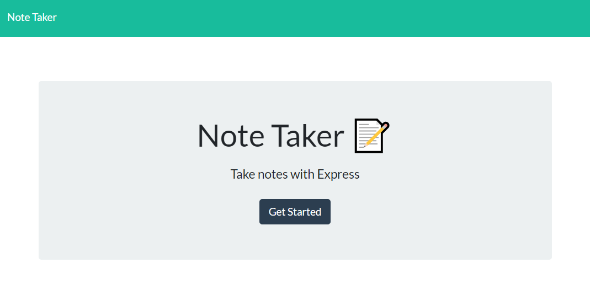
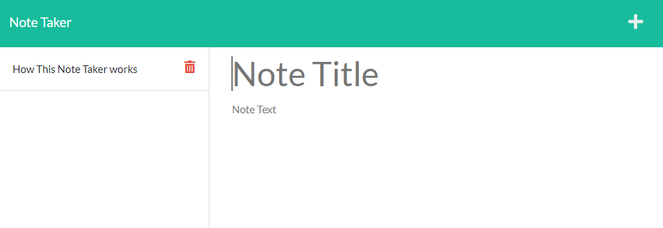
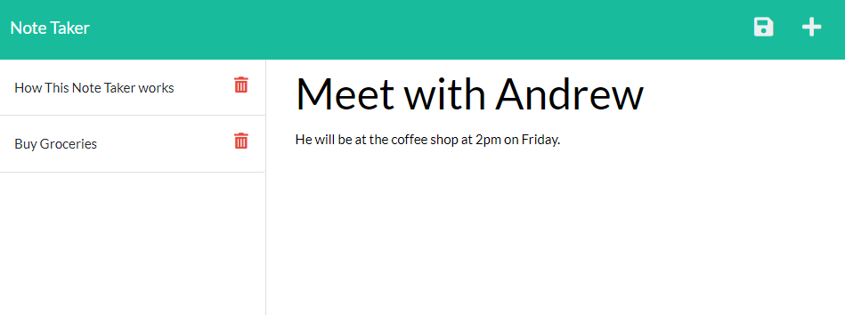

# Note Taker

## Table of Contents

- [Note Taker](#note-taker)
  - [Table of Contents](#table-of-contents)
  - [Description](#description)
  - [Deployment](#deployment)
  - [Installation](#installation)
  - [Usage](#usage)
  - [Contributing](#contributing)
  - [Tests](#tests)
  - [Screenshots](#screenshots)
  - [License](#license)
  - [Questions](#questions)

## Description

A project for my bootcamp to create a note-taking website that is deployed on Heroku, and uses express.js to handle HTTPS and API calls. The app let's you create notes, save them to the site, read over previous notes, and delete one's that are no longer needed.

## Deployment

You can find a version of this website deployed on Heroku here: [https://safe-cliffs-30809.herokuapp.com/](https://safe-cliffs-30809.herokuapp.com/)

## Installation

To create you own note website, simply download the code onto your device. Then, in the directory you put this in, run `npm start`. The note taker app will then be running on your computer, on port 3001. 

This application can also be deployed on Heroku if desired, by following the advice here: [https://devcenter.heroku.com/articles/deploying-nodejs](https://devcenter.heroku.com/articles/deploying-nodejs)

## Usage

Once the webpage is opened, click on the "get started" button to open the program.

To create a new note, hit the plus button in the upper-right corner.

You can then write your title, then your notes. Once done, you can save the note by clicking the save icon in the upper right corner. (It will only appear if a title and note has been typed in.)

To see your previous note, click on the note name displayed on the left-hand side, and your note will be displayed in the main note area.

To delete a note, click on the trashcan icon next to the note title you want to delete.

## Contributing

Anyone can fork this project and add features. However, all changes to the main section must be approved by the Admin.

## Tests

There are no testing procedures for this project.

## Screenshots

## License

This project is licensed under a [MIT license](https://opensource.org/licenses/MIT).

## Questions

If you have any questions, please send them to [WRuback](https://github.com/WRuback) at wrubackdev@gmail.com with the heading "Note Taker Question".
